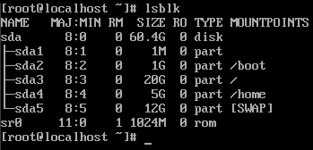
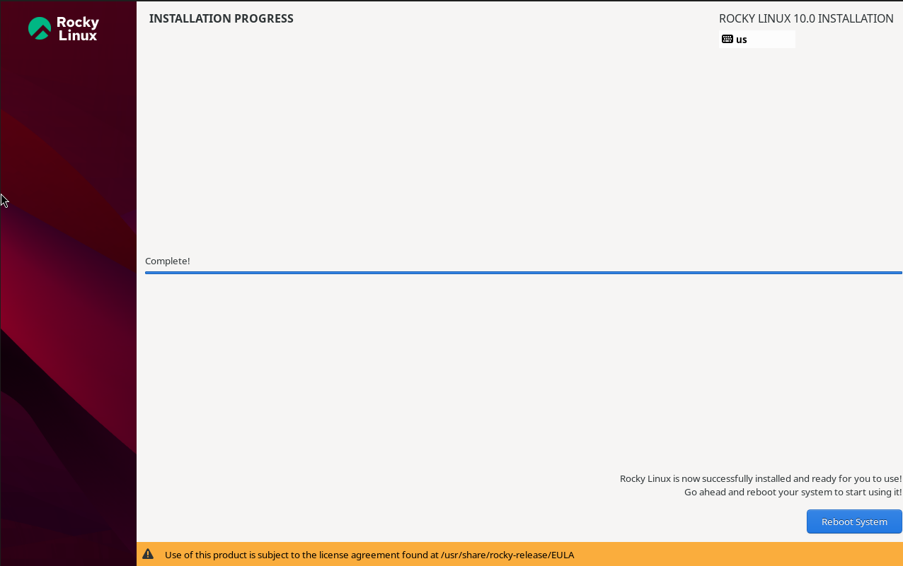
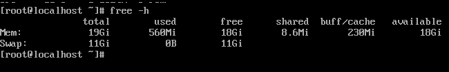

# Bitácora del Proyecto LFS

**Integrantes:** Marcelo Avalos  
**Fecha de inicio:** 16 de Noviembre

---

## Sesión 1: 17 de Noviembre - Instalación Rocky Linux 10 Host

**Duración:** 45 mins aprox. (11:30 - 12:15)  
**Participantes:** Marcelo Avalos  
**Objetivo:** Instalar Rocky Linux 10 como host para LFS con particiones optimizadas

### Tareas Realizadas
- [x] Descargar Rocky Linux 10 ISO
- [x] Crear VM (4 CPU, 11.5GB RAM, 60GB disco)
- [x] Configurar esquema de particiones personalizado
- [x] Completar instalación básica

### Comandos ejecutados post-instalación:
lsblk
free -h

### Resultados:

    Particiones: / (20G), /home (5G), swap (12G), libre (22G)

    RAM: 11.5GB confirmada

    Versión: Rocky Linux 10.0 

### Problemas Encontrados

Problema: Tamaño de /home posiblemente pequeño para desarrollo extenso

    Solución: Como la mayoría de LFS se construye en la partición dedicada, el host no precisa de un /home grande

    Aprendizaje: El espacio crítico está en la partición LFS, no en /home del host

### Resultados Obtenidos

    ✅ Rocky Linux 10 instalado y funcionando

    ✅ 22GB espacio libre reservado para LFS

    ✅ Sistema listo para configuración LFS

### Reflexión Técnica

"El esquema de particiones prioriza espacio para LFS. Los 22GB libres deberían ser suficientes para sistema base según el manual LFS. El swap generoso (12GB) ayudará en compilaciones intensivas. La partición /home de 5GB es adecuada para documentación y configuraciones del proyecto."
Evidencias

*Figura 1: Salida del comando lsblk mostrando el esquema de particiones*

*Figura 2: Instalación de Rocky Linux 10 completada*

*Figura 3: Salida de free -h mostrando memoria disponible*

---
---
