# Bitácora del Proyecto LFS

**Integrantes:** Marcelo Avalos  
**Fecha de inicio:** 17 de Noviembre

---

## Sesión 1: 17 de Noviembre - Instalación Rocky Linux 10 Host

**Duración:** 45 mins aprox. (11:30 - 12:15)  
**Participantes:** Marcelo Avalos  
**Objetivo:** Instalar Rocky Linux 10 como host para LFS con particiones optimizadas

### Tareas Realizadas
- [x] Descargar Rocky Linux 10 ISO
- [x] Crear VM (4 CPU, 11.5GB RAM, 60GB disco)
- [x] Configurar esquema de particiones personalizado
- [x] Completar instalación básica


### Comandos ejecutados post-instalación:
lsblk
free -h


### Resultados:

    Particiones: / (20G), /home (5G), swap (12G), libre (22G)

    RAM: 11.5GB confirmada

    Versión: Rocky Linux 10.0 

### Problemas Encontrados

Problema: Tamaño de /home posiblemente pequeño para desarrollo extenso

    Solución: Como la mayoría de LFS se construye en la partición dedicada, el host no precisa de un /home grande

    Aprendizaje: El espacio crítico está en la partición LFS, no en /home del host

### Resultados Obtenidos

    ✅ Rocky Linux 10 instalado y funcionando

    ✅ 22GB espacio libre reservado para LFS

    ✅ Sistema listo para configuración LFS

### Reflexión Técnica

"El esquema de particiones prioriza espacio para LFS. Los 22GB libres deberían ser suficientes para sistema base según el manual LFS. El swap generoso (12GB) ayudará en compilaciones intensivas. La partición /home de 5GB es adecuada para documentación y configuraciones del proyecto."
Evidencias


*Figura 1: Salida del comando lsblk mostrando el esquema de particiones*


*Figura 2: Instalación de Rocky Linux 10 completada*


*Figura 3: Salida de free -h mostrando memoria disponible*


---
---

## Sesión 2: 18 de Noviembre, 19:40 a 20:52 - Preparación Completa del Entorno LFS

**Duración:** 1 hora aprox.
**Participantes:** Marcelo Avalos  
**Objetivo:** Verificar requisitos del host, crear partición LFS y preparar entorno completo

### Tareas Realizadas
- [x] Ejecutar `version-check.sh` del manual LFS
- [x] Identificar paquetes faltantes en el sistema host
- [x] Instalar herramientas de desarrollo necesarias
- [x] Configurar enlace simbólico yacc → bison
- [x] Crear partición LFS en espacio libre de 21GB
- [x] Formatear partición LFS como ext4
- [x] Verificar todas las herramientas requeridas

### Comandos Ejecutados
```bash


# Verificación inicial
bash version-check.sh

# Instalación de paquetes faltantes
dnf install bison m4 patch perl 
dnf install gcc gcc-c++ make


# Configuración de yacc
ln -sv /usr/bin/bison /usr/bin/yacc

# Creación de partición LFS con parted
parted /dev/sda
print free          # Ver espacio libre
parted /dev/sda mkpart primary ext4 40.8GB 63.8GB
quit

# Formatear partición
mkfs -t ext4 /dev/sda6

# Verificación final
bison --version
yacc --version
bash version-check.sh
```

### Problemas Encontrados
**Problema 1:** Comandos `gcc`, `g++` y `make` no encontrados
- **Causa:** Paquetes de desarrollo no instalados
- **Solución:** `dnf install gcc gcc-c++ make`

**Problema 2:** `yacc` no encontrado pero `bison` sí estaba disponible
- **Causa:** Rocky Linux usa bison como reemplazo de yacc
- **Solución:** `ln -sv /usr/bin/bison /usr/bin/yacc`

**Problema 3:** `texinfo` no disponible en repositorios base
- **Causa:** Repositorio CRB deshabilitado por defecto
- **Solución:** 
```bash
dnf config-manager --set-enabled crb
dnf install texinfo
```

**Problema 4:** Faltaban los paquetes perl, m4 y patch
- **Causa:** No incluidos en el grupo de desarrollo
- **Solución:** `dnf install m4 patch perl`

**Problema 5:** Error de symlink - creé `/usr/bin/yac` por error
- **Causa:** Mal tipeado el comando
- **Solución:** `rm -v /usr/bin/yac` 

### Resultados Obtenidos
- ✅ Todas las herramientas de verificación instaladas
- ✅ `version-check.sh` ejecutado exitosamente
- ✅ GCC confirmado (versión superior a la mínima requerida)
- ✅ Partición LFS creada (/dev/sda6 de ~21GB)
- ✅ Partición formateada como ext4 
- ✅ Entorno host completamente preparado para LFS

### Reflexión Técnica
"La preparación del entorno LFS mostró la importancia de verificar meticulosamente cada herramienta. El habilitar el repositorio CRB fue crucial para obtener texinfo. Los problemas con yacc se resolvieron fácilmente con symlinks, pero hay que tener cuidado con los errores de tipeo en los comandos."

### Evidencias
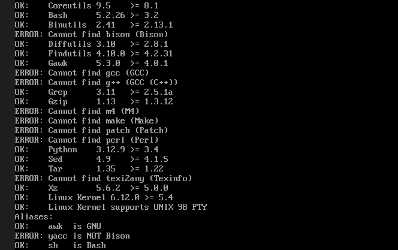
*Figura 1: Requisitos necesarios a completar*

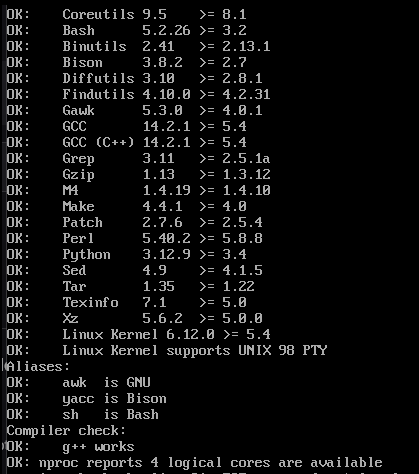
*Figura 21: Requisitos necesarios completados*

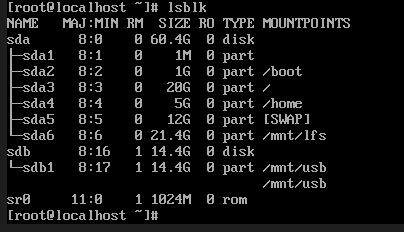
*Figura 3: Particion LFS creada*

### Apuntes

Utilicé inteligencia artificial para ayudar a mejorar el formato Markdown y la gramática de la bitácora, así como para consultar comandos desconocidos como parted y el repositorio alternativo crb.

```
```

## Sesión 3: 18 de Noviembre - 21:06 a 22:09 - Configuración del Entorno LFS y Descarga de Paquetes

**Duración:** 1 hora aprox.
**Participantes:** Marcelo Avalos
**Objetivo:** Configurar entorno LFS, crear estructura de directorios y descargar todos los paquetes fuente
### Tareas Realizadas

- [x] Configurar variable de entorno LFS
- [x] Establecer umask para permisos seguros
- [x] Montar partición LFS en el punto de montaje
- [x] Configurar permisos de ownership y acceso
- [x] Crear directorio sources con permisos adecuados
- [x] Descargar paquetes fuente usando wget-list-systemd
- [x] Completar descargas faltantes desde mirror alternativo
- [x] Verificar integridad con md5sums

### Comandos Ejecutados
```bash

# Configurar variables de entorno críticas
export LFS=/mnt/lfs
umask 022

# Montar partición LFS
mkdir -pv $LFS
mount -v -t ext4 /dev/sda6 $LFS

# Configurar permisos de ownership y acceso
chown root:root $LFS
chmod 755 $LFS

# Crear directorio sources y configurar permisos
mkdir -v $LFS/sources
chmod -v a+wt $LFS/sources

# Descargar paquetes usando la lista oficial
wget --input-file=wget-list-systemd --continue --directory-prefix=$LFS/sources

# Descargar paquetes faltantes desde mirror alternativo
wget --continue --directory-prefix=$LFS/sources https://lfs.gnlug.org/pub/lfs/lfs-packages/12.4/[nombre-paquete-faltante]

# Verificar integridad de los paquetes
pushd $LFS/sources
  md5sum -c md5sums
popd
```

### Problemas Encontrados

**Problema 1:** Algunos paquetes fallaron en la descarga con la lista oficial

- **Causa:** Problemas de conectividad con los servidores oficiales

- **Solución:** Usar mirror alternativo https://lfs.gnlug.org/pub/lfs/lfs-packages/12.4/ para completar las descargas

**Problema 2**: Necesidad de verificar integridad de paquetes descargados

- **Causa**: Descargas desde múltiples fuentes

- **Solución**: Usar md5sum -c md5sums y  md5sum -c md5sums | grep -v "OK$", regex con grep para validar todos los archivos y verificar si alguna linea no termina con OK.

**Problema 3**: Se apagó inesperadamente la PC

- **Causa**: Corte de electricidad inesperada

- **Solución**: Montar $LFS de nuevo y asegurarse de que todo tenga los privilegios necesarios ejecutando los comandos de permisos nuevamente

### Resultados Obtenidos

    ✅ Variables de entorno LFS configuradas correctamente

    ✅ Partición LFS montada y con permisos adecuados

    ✅ Directorio sources creado con permisos a+wt

    ✅ Todos los paquetes fuente de LFS descargados

    ✅ Integridad de paquetes verificada con md5sums

    ✅ Entorno listo para comenzar la construcción de LFS

### Reflexión Técnica

"La descarga de paquetes desde múltiples mirrors es una práctica común en LFS debido a la disponibilidad variable de los servidores. La verificación con md5sums es crucial para asegurar que no haya corrupción en los archivos fuente. El directorio sources con permisos a+wt permite que múltiples usuarios puedan escribir y acceder temporalmente a los archivos durante el proceso de construcción."


### Evidencias

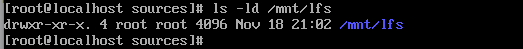
*Figura 1: Privilegio configurado $LFS*


*Figura 2: Checkeo de los archivos descargados con md5*

### Apuntes

Utilicé inteligencia artificial para ayudar a mejorar el formato Markdown y la gramática de la bitácora, así como para consultar comandos desconocidos como hacer el regex para el md5sum check .

```
```

## Sesión 4: 19 de Noviembre - 11:53 a 12:45- Configuración Completa del Usuario LFS y Estructura de Directorios

**Duración:** 1 hora aprox.  
**Participantes:** Marcelo Avalos  
**Objetivo:** Crear estructura de directorios LFS, usuario lfs, configurar entorno de construcción

### Tareas Realizadas
- [x] Crear estructura básica de directorios LFS
- [x] Crear enlaces simbólicos para compatibilidad
- [x] Crear directorio lib64 para arquitectura x86_64
- [x] Crear directorio tools para toolchain temporal
- [x] Crear grupo y usuario lfs
- [x] Establecer password para el usuario lfs
- [x] Transferir ownership de directorios LFS al usuario lfs
- [x] Configurar archivos de entorno (.bash_profile y .bashrc)
- [x] Verificar carga correcta de variables de entorno

### Comandos Ejecutados
```bash
# Crear estructura básica de directorios LFS
mkdir -pv $LFS/{etc,var} $LFS/usr/{bin,lib,sbin}

# Crear enlaces simbólicos para compatibilidad
for i in bin lib sbin; do
  ln -sv usr/$i $LFS/$i
done

# Crear lib64 para arquitecturas x86_64
case $(uname -m) in
  x86_64) mkdir -pv $LFS/lib64 ;;
esac

# Crear directorio tools para toolchain temporal cruzada
mkdir -pv $LFS/tools

# Crear grupo y usuario lfs para construcción
groupadd lfs
useradd -s /bin/bash -g lfs -m -k /dev/null lfs
passwd lfs

# Transferir ownership de directorios críticos al usuario lfs
chown -v lfs $LFS/{usr{,/*},var,etc,tools}
case $(uname -m) in
  x86_64) chown -v lFS/lib64 ;;
esac

# Configurar archivos de entorno del usuario lfs
cat > ~/.bash_profile << "EOF"
...
EOF

cat > ~/.bashrc << "EOF"
....
EOF

#Instalar tree
como root
dnf install tree
tree /mnt/lfs 

### Verificar configuración completa
ls -la $LFS/
ls -la $LFS/tools
id lfs
source ~/.bash_profile
echo "LFS: $LFS"
echo "LFS_TGT: $LFS_TGT"
```
### Problemas Encontrados

No se encontraron problemas significativos - toda la configuración se completó exitosamente.
Resultados Obtenidos

    ✅ Estructura de directorios LFS creada correctamente

    ✅ Enlaces simbólicos configurados para compatibilidad

    ✅ Directorio tools creado para toolchain temporal cruzada

    ✅ Usuario lfs creado y configurado

    ✅ Dueño de directorios transferido al usuario lfs

    ✅ Archivos de entorno configurados y verificados

    ✅ Entorno completamente preparado para comenzar toolchain temporal

### Reflexión Técnica

"La estructura de directorios LFS sigue el Filesystem Hierarchy Standard moderno donde /bin, /lib y /sbin son enlaces simbólicos a /usr. El directorio /tools es crucial para alojar la toolchain temporal cruzada, separándola del sistema host. La creación del usuario lfs dedicado asegura un entorno limpio y aislado para la construcción."
### Evidencias


*Figura 1: Tree de LFS*

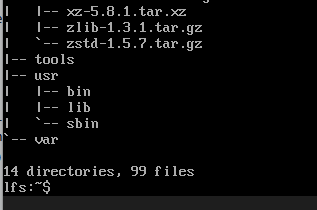
*Figura 2: Tree de LFS parte 2*

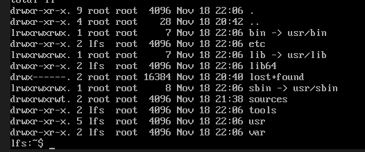
*Figura 3: Privilegios*


### Apuntes

Utilicé inteligencia artificial para ayudar a mejorar el formato Markdown y la gramática de la bitácora, así como para consultar comandos como tree para hacer la imagen de la estructura del lfs.


```
```


-----


## Sesión 5: 20 de Noviembre - 19:34 a 22:27 - Instalación de la Cadena de Herramientas Cruzada (Pass 1)


**Duración:** 3 horas aprox.
**Participantes:** Marcelo Avalos
**Objetivo:** Instalar el *cross-toolchain* (Binutils, GCC, Linux Headers y Glibc) en el directorio `$LFS/tools` y la partición `$LFS` para preparar el entorno de compilación cruzada.


### Tareas Realizadas


  - [x] **5.2. Binutils-2.45 - Pass 1:** Instalación del *cross-linker*.
  - [x] **5.3. GCC-15.2.0 - Pass 1:** Instalación del *cross-compiler* C y C++.
  - [x] **5.4. Linux-6.16.1 API Headers:** Instalación de los *headers* del kernel en `$LFS/usr`.
  - [x] **5.5. Glibc-2.42 - Pass 1:** Instalación de la biblioteca C principal en `$LFS/usr`.
  - [x] Ejecución y verificación de las pruebas de sanidad (*Sanity Checks*).


### Comandos principales ejecutados:


#### 1\. Binutils-2.45 - Pass 1


```bash
mkdir -v build; cd build
../configure --prefix=$LFS/tools --with-sysroot=$LFS --target=$LFS_TGT ...
make
make install
```


#### 2\. GCC-15.2.0 - Pass 1


```bash
# Extracción de dependencias (mpfr, gmp, mpc)
# Aplicación de sed para x86_64
mkdir -v build; cd build
../configure --target=$LFS_TGT --prefix=$LFS/tools --with-newlib ...
make
make install
cd ..
cat gcc/limitx.h ... > $(dirname $($LFS_TGT-gcc -print-libgcc-file-name))/include/limits.h
```


#### 3\. Linux-6.16.1 API Headers


```bash
make mrproper
make headers
cp -rv usr/include $LFS/usr
```


#### 4\. Glibc-2.42 - Pass 1


```bash
# Creación de enlaces simbólicos (ld-lsb.so.3, etc.)
patch -Np1 -i ../glibc-2.42-fhs-1.patch
mkdir -v build; cd build
echo "rootsbindir=/usr/sbin" > configparms
../configure --prefix=/usr --host=$LFS_TGT --enable-kernel=5.4 ...
make
make DESTDIR=$LFS install
sed '/RTLDLIST=/s@/usr@@g' -i $LFS/usr/bin/ldd
```


#### 5\. Pruebas de Sanidad (*Sanity Checks*)


```bash
echo 'int main(){}' | $LFS_TGT-gcc -x c - -v -Wl,--verbose &> dummy.log
readelf -l a.out | grep ': /lib'
grep -E -o "$LFS/lib.*/S?crt[1in].*succeeded" dummy.log
rm -v a.out dummy.log
```


### Resultados:


| Paquete | Estado |
| :--- | :--- |
| **Binutils-2.45 (P1)** | ✅ Completado |
| **GCC-15.2.0 (P1)** | ✅ Completado |
| **Linux API Headers** | ✅ Completado |
| **Glibc-2.42 (P1)** | ✅ Completado |


**Resultado Sanity Check:** Se verificó que el intérprete de programas solicitado (dynamic linker) apunta a la ruta correcta dentro de `$LFS` y que los *start files* fueron localizados con éxito, confirmando que la cadena de herramientas cruzada está funcional.


```text
[Requesting program interpreter: /lib64/ld-linux-x86-64.so.2]
/mnt/lfs/lib/../lib/Scrt1.o succeeded
/mnt/lfs/lib/../lib/crti.o succeeded
/mnt/lfs/lib/../lib/crtn.o succeeded
```


### Problemas Encontrados


**Problema:** Durante la configuración de Glibc, el compilador del host arrojó una advertencia de que el programa **`msgfmt` estaba faltando** o era incompatible.


```text
configure: WARNING: *** These auxiliary programs are missing or ... msgfmt ***
```


**Solución:** Se decidió continuar, basándose en la documentación de LFS que indica que **`msgfmt` es parte de Gettext** (internacionalización), una característica no esencial para la construcción de las herramientas temporales, y por lo tanto la advertencia fue inofensiva.


**Aprendizaje:** Las advertencias relacionadas con NLS (National Language Support) o internacionalización a menudo pueden ignorarse en la construcción de herramientas temporales.


### Reflexión Técnica


"Concluye así la instalación de la fase de herramientas cruzadas (Pass 1). Utilizamos la opción `make DESTDIR=$LFS install` en Glibc para asegurar que la biblioteca se instalará en el destino final (`$LFS`) y no en el sistema *host*. La clave fue el éxito de las **Pruebas de Sanidad** que verificaron que el compilador `$LFS_TGT-gcc` está buscando las bibliotecas y *headers* correctos en `$LFS`, garantizando que se está listo para comenzar a compilar los paquetes temporales dentro del *chroot*."


### Evidencias


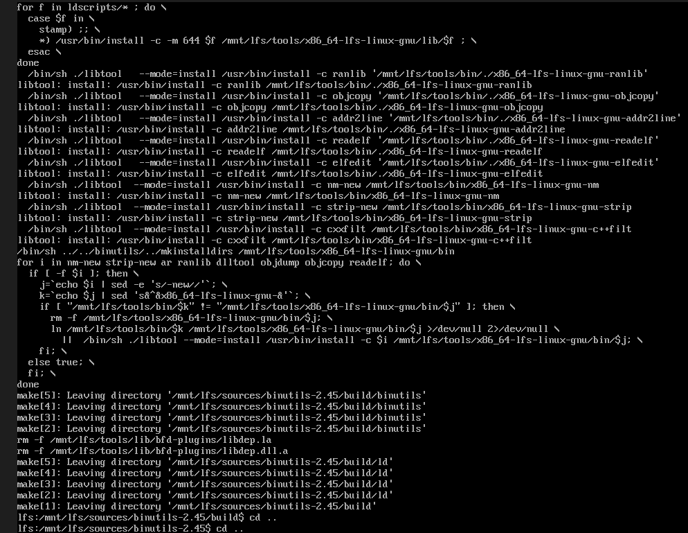
*Figura 1: Binutils make install*


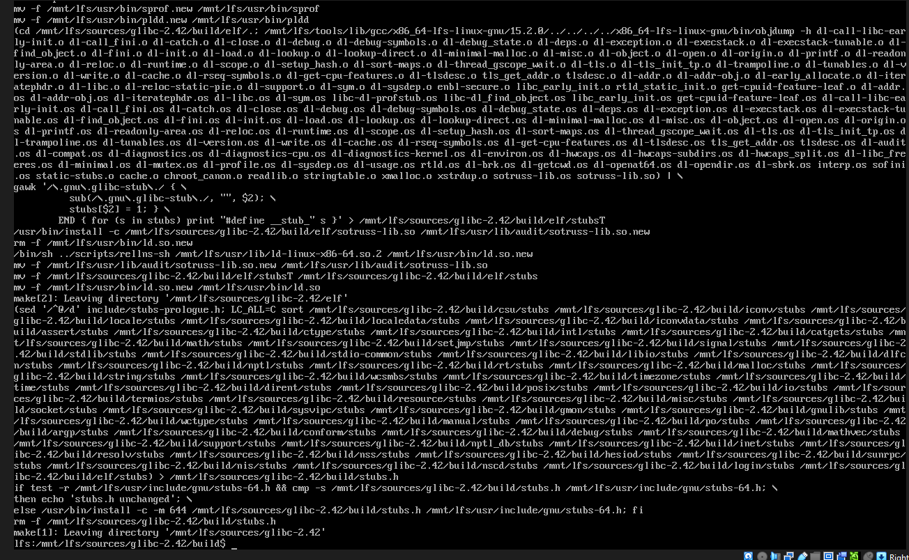
*Figura 2: glibc make install*


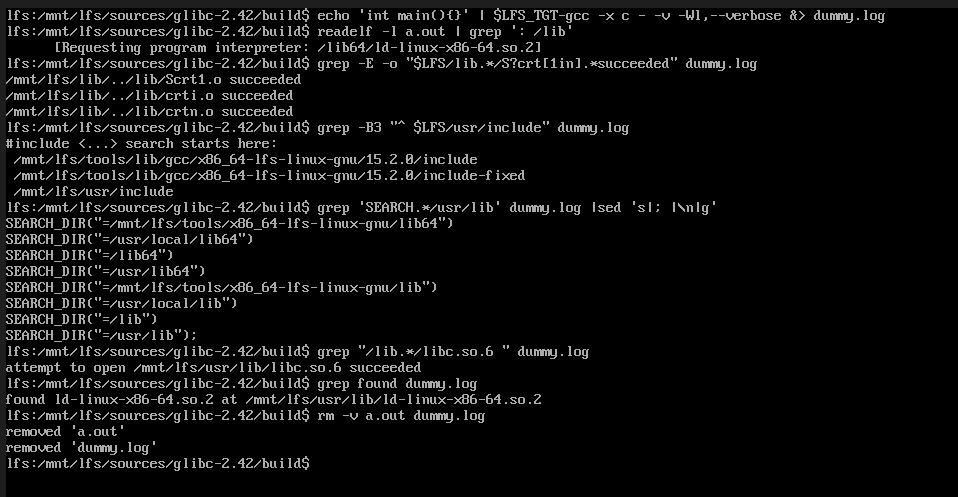
*Figura 2: sanity check glibc*


### Apuntes


Se utilizó inteligencia artificial para ayudar a mejorar el formato Markdown y la gramática de la bitácora.


```
```


## Sesion 6: 21 de Noviembre, 21:02 a 22:39 - Compilación de Herramientas Temporales (Capítulos 5.6 al 6.4)

**Duración:** 1 hora y media aprox. **Participantes:** Marcelo Avalos **Objetivo:** Compilar Libstdc++ y las primeras herramientas temporales (M4, Ncurses, Bash) en el entorno $LFS para construir el sistema base.

### Tareas Realizadas

    [x] Compilación e instalación de la librería estándar de C++: Libstdc++ (del paquete GCC-15.2.0).

    [x] Compilación e instalación del macro procesador: M4-1.4.20.

    [x] Compilación e instalación de librerías para manejo de pantalla: Ncurses-6.5-20250809.

    [x] Instalación del programa auxiliar tic de Ncurses en $LFS/tools/bin.

    [x] Creación del enlace simbólico libncurses.so a libncursesw.so y ajuste del header curses.h.

    [x] Compilación e instalación del shell Bourne-Again: Bash-5.3.

    [x] Creación del enlace simbólico /bin/sh apuntando a /bin/bash dentro de $LFS.

## Comandos Ejecutados

1. Libstdc++ (del paquete GCC-15.2.0)


#### Dentro del directorio de las fuentes de GCC
```bash
mkdir -v build
cd build
../libstdc++-v3/configure ...
make
make DESTDIR=$LFS install
rm -v $LFS/usr/lib/lib{stdc++{,exp,fs},supc++}.la

```
2. M4-1.4.20


```bash
# Dentro del directorio de las fuentes de M4
./configure --prefix=/usr   \
    --host=$LFS_TGT \
    --build=$(build-aux/config.guess)
make
make DESTDIR=$LFS install
```
3. Ncurses-6.5-20250809


```bash
# Dentro del directorio de las fuentes de Ncurses
mkdir build
pushd build
  ../configure --prefix=$LFS/tools AWK=gawk
  make -C include
  make -C progs tic
  install progs/tic $LFS/tools/bin
popd

./configure ...
make
make DESTDIR=$LFS install
ln -sv libncursesw.so $LFS/usr/lib/libncurses.so
sed -e 's/^#if.*XOPEN.*$/#if 1/' -i $LFS/usr/include/curses.h
```
4. Bash-5.3


```bash
# Dentro del directorio de las fuentes de Bash
./configure ....
make
make DESTDIR=$LFS install
ln -sv bash $LFS/bin/sh
```


```bash

# Siempre borrando las carpetas al terminar de compilar con:

rm -rf $LFS/sources/[nombre_del_directorio]
```
⚠️ Problemas Encontrados

    Ningun problema en particular

📊 Resultados Obtenidos

    ✅ Libstdc++ instalado en $LFS/usr/lib y sus headers en $LFS/tools/$LFS_TGT/include/c++/15.2.0, completando el cross-toolchain inicial.

    ✅ M4 instalado exitosamente en el directorio $LFS.

    ✅ Ncurses y su binario tic instalados, preparando las librerías para futuros paquetes que interactúan con la terminal.

    ✅ Bash instalado como el shell principal, con el enlace simbólico /bin/sh creado.

    ✅ El entorno de herramientas temporales está en progreso, listo para continuar con Binutils-2.42.

🧠 Reflexión Técnica

"Esta sesión consolidó el cross-toolchain al instalar Libstdc++ contra la Glibc recién compilada en $LFS. Es clave entender que la compilación cruzada a menudo requiere pasos especiales, como la instalación del programa tic de Ncurses o el uso de opciones como --without-bash-malloc en Bash, que mitigan problemas de estabilidad o dependencia. El proceso avanza con éxito hacia la construcción de un entorno de herramientas temporales completamente funcional."

### Evidencias


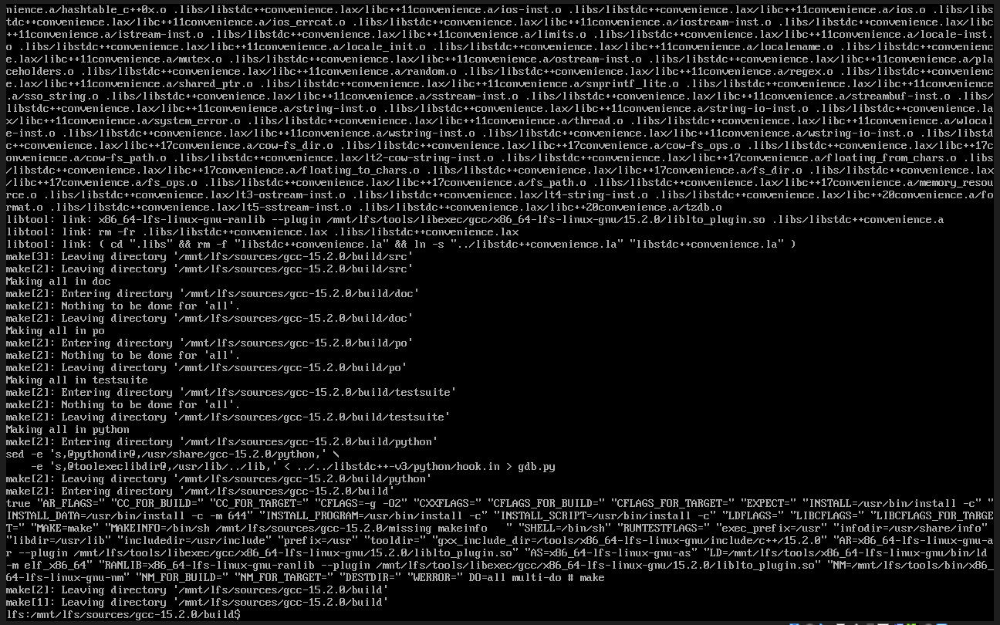
*Figura 1: libstdc++ make*

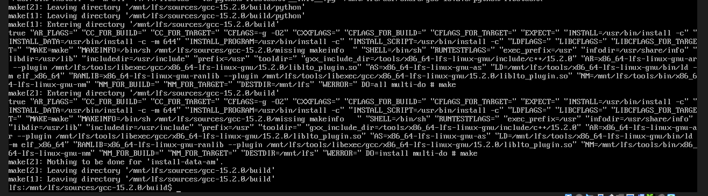
*Figura 2: libstdc++ make install*

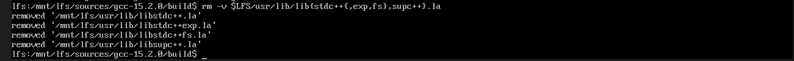
*Figura 3: commando remover archivos de libtool*

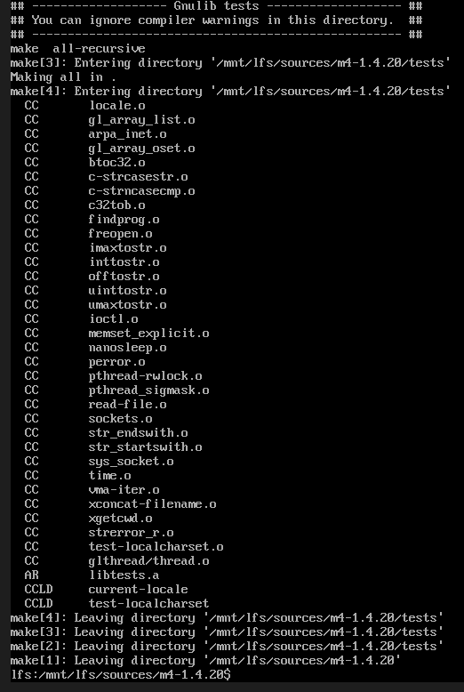
*Figura 4: make de M4*

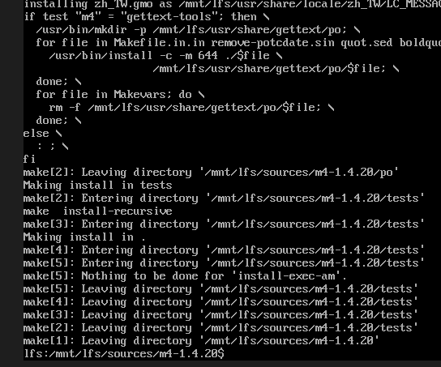
*Figura 5: make install M4*

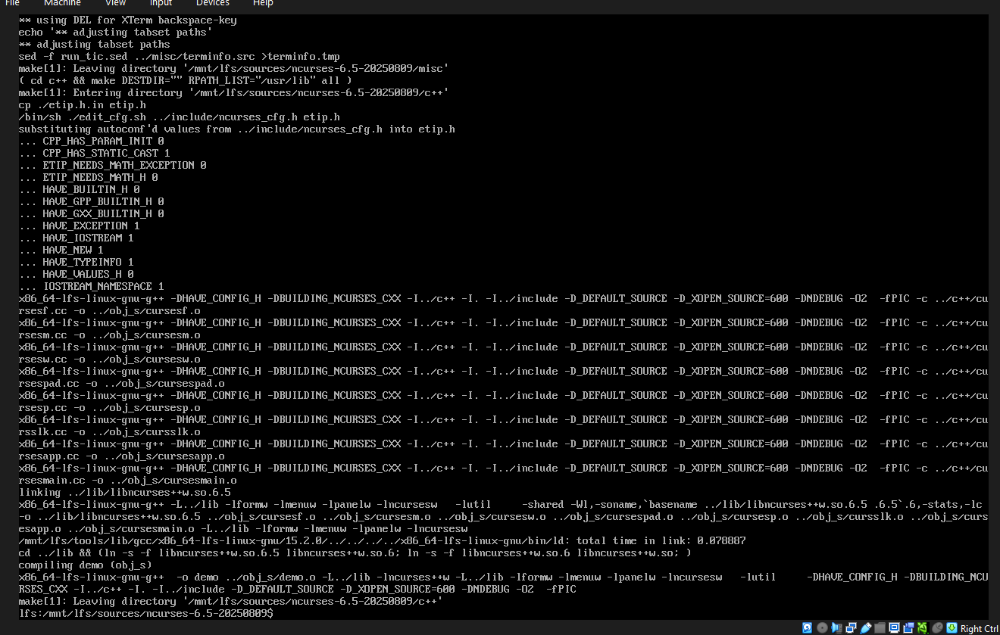
*Figura 6: make ncurses*

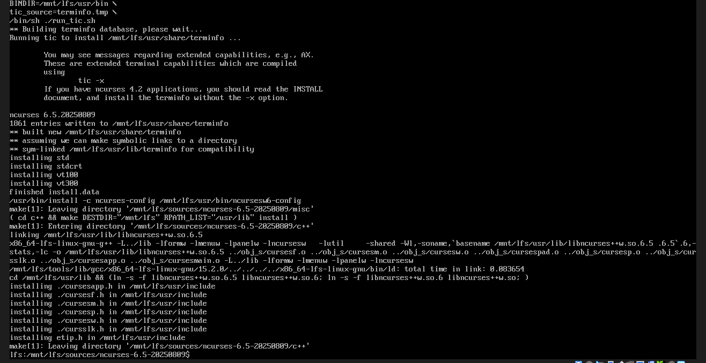
*Figura 7: make install ncurses*


*Figura 8: ln y sed ncurses*

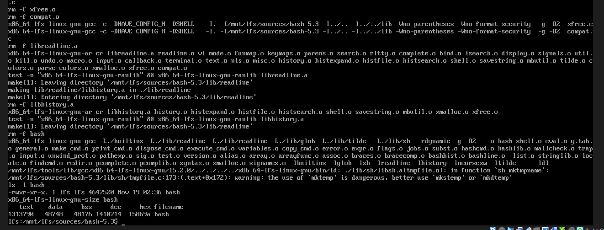
*Figura 9: make Bash*

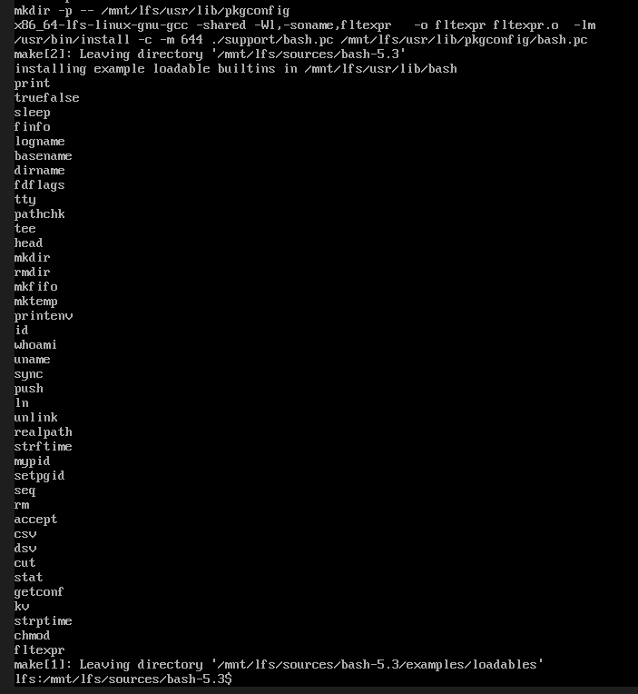
*Figura 10: make install Bash*


### Apuntes
  Se utilizo inteligencia artificual para mejorar el formateao y gramatica.


